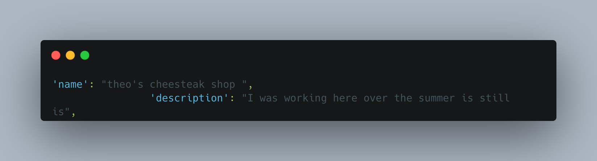

# " stuff i do "

## What did I build?

["Stuff I Do"](https://bienmari.github.io/my-first-map3/) For this, you can zoom in and zoom out and click at 3 certain places. I've been over this summer the most because they were the only ones I was at every day you can see sf and oakland and other citys i been to 2 city oakland and san leandro you can see those i and zoom in here its located

## Tech stack

To build this app, I used the following tools:

1. [Google Maps](https://www.google.com/maps), I used google maps to get the cordantes of the places where i have gone over the summer.
2. [Mapbox GL JS](https://docs.mapbox.com/mapbox-gl-js/guides) i used mapbox to get the custamastion for my map and what we used to create my map. 
3. [Visual Studio Code](https://code.visualstudio.com/download) this is where im working on my code right now.
4. [GitHub pages](https://docs.github.com/en/pages/getting-started-with-github-pages/creating-a-github-pages-site),  that where i have my map and my code and my first map

# Spotlight

this code i reallt like that is the main characters because its where i worked all summer and i  wanted to talk more about it becasue  anyone can look at it and they can see a place to vist when ever they need ideas to check out a small shop to go eat eat.

